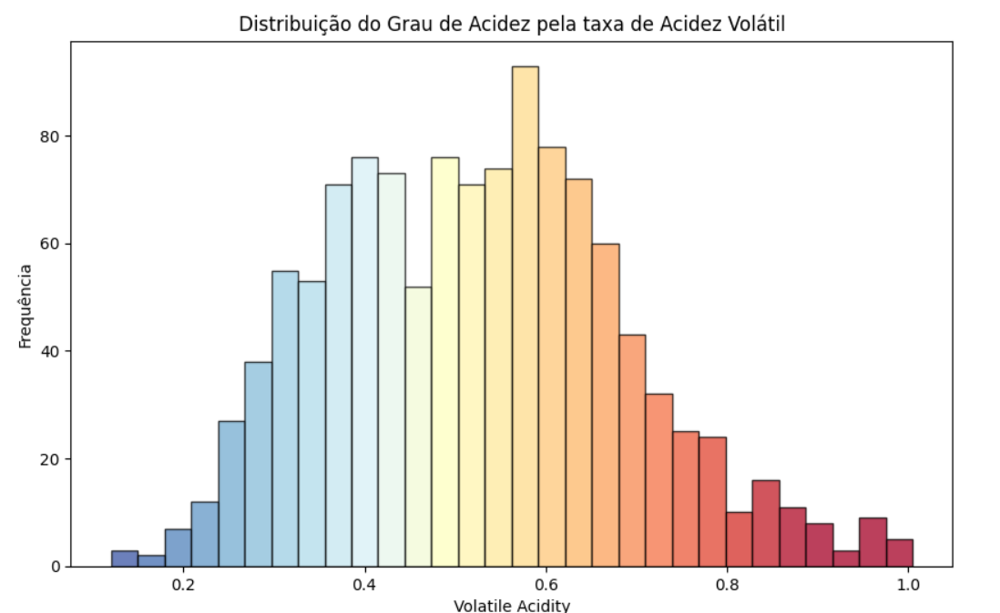
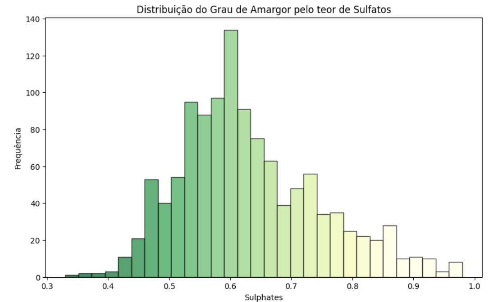
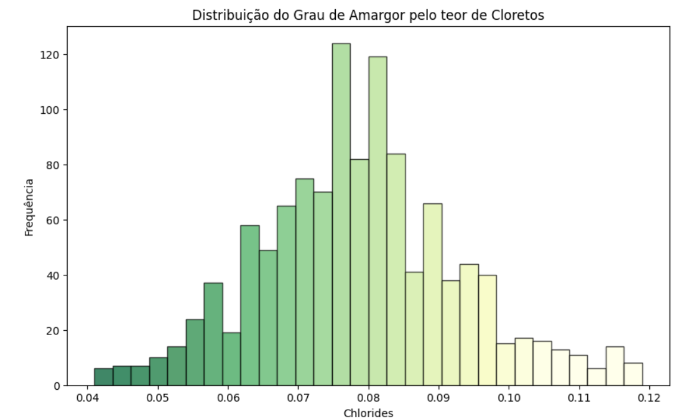
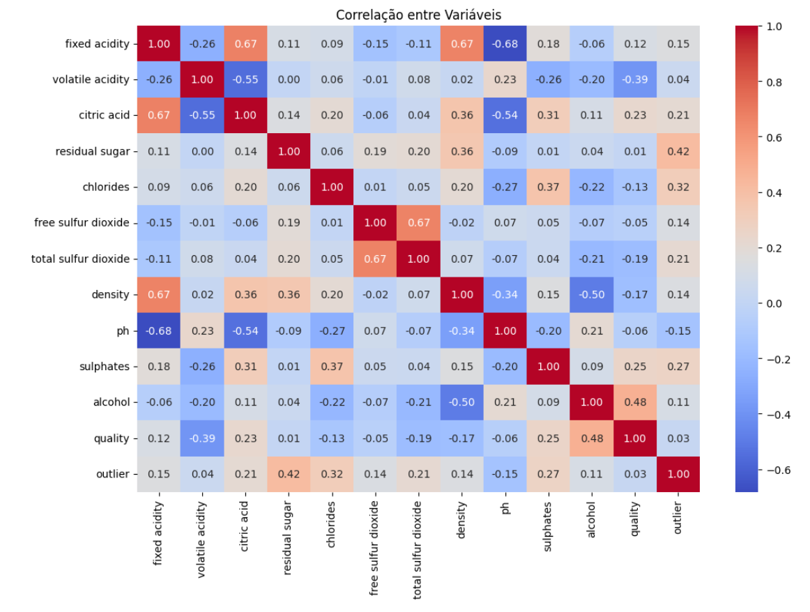

# Análise Estatística e Visualização de Dados 
Código desenvolvido para tratamento, limpeza, processamento, preparo, análise estatística e visualização de dados com a base de dados [Red Wine Quality](https://www.kaggle.com/datasets/uciml/red-wine-quality-cortez-et-al-2009) disponível no Kaggle. 

O projeto visou cumprir os requisitos de **Estatística**, do bootcamp de Ciência de Dados da **Ada Tech**, patrocinado pelo **Potência Tech**, do **iFood**. 

O projeto foi realizado em fevereiro de 2024 e contou com a colaboração de 4 integrantes:
* Carlos André
* Jhenyffer Oliveira
* Rodrigo Udenal
* Wallace Souza

# Análise Geral

## Tendências Gerais com base nos gráficos

**1. Taxa de Acidez Volátil:**

+ A maioria dos vinhos exibe uma taxa de acidez volátil que varia de baixa a moderada, com uma concentração notável entre 0.2 e 0.6.
+ Observa-se uma cauda à direita no histograma, no entanto, indicando que há alguns vinhos com taxas de acidez volátil altas, embora menos comuns.

**2. Teor de Cloretos:**

+ A análise revela que a maioria dos vinhos possui um teor de cloretos concentrado em valores mais baixos.
+ A distribuição dos cloretos é assimétrica, apresentando uma cauda mais longa em direção aos valores mais altos.
+ Isso elucida que, embora a maioria dos vinhos tenha baixo teor de cloretos, existem alguns vinhos com níveis mais elevados.

**3. Associação com o Grau de Amargor:**

+ A presença de cloretos é associada ao grau de amargor do vinho, já que essa substância tem potencial para contribuir para essa sensação de amargor.
+ Com base em nossas análises, pode-se inferir que a concentração de cloretos em níveis mais elevados tenha influência direta na percepção do amargor dos vinhos.

**4. Correlação com Qualidade e Heatmap de Correlação:**

+ Sulphates: Existe uma correlação positiva, mas moderada, entre teor de sulfatos e qualidade. Isso sugere que vinhos com níveis mais altos de sulfatos sejam percebidos como de melhor qualidade.
+ Volatile Acidity: Existe uma correlação negativa forte entre acidez volátil e qualidade do vinho. Isso sugere que vinhos com altos níveis de acidez volátil sejam percebidos como de menor qualidade.
+ Variáveis 'alcohol', 'sulphates' e 'citric acid' demonstram correlações positivas moderadas com 'quality'. Isso sugere que vinhos com teor alcoólico mais alto, níveis mais elevados de sulfatos e ácido cítrico podem estar associados a uma maior qualidade nos vinhos.
+ Variáveis 'volatile acidity' e 'total sulfur dioxide' demostram correlações negativas moderadas com 'quality'. Isso indica que altos níveis de acidez volátil e dióxido de enxofre total podem estar associados a uma menor qualidade nos vinhos.

## Observações:
+ Devido a questões de privacidade, não há informações sobre tipos de uva, rótulos, preço etc.
+ As cores dos gráficos foram escolhidas para facilitar a visualização dos dados.
+ Os gráficos estão legendados em português para facilitar a compreensão dos resultados.

# Ferramentas utilizadas

| Python | Numpy | Pandas | Seaborn | Matplotlib | Git | 
| ------ | ----- | ------ | ------- | ---------- | --- | 
|  |  |  | |  |  |

# Como rodar

> Clique [aqui](https://github.com/UdenalR/wine_analysis_2024/blob/master/wine_analysis.ipynb) e visualize as análises realizadas.
